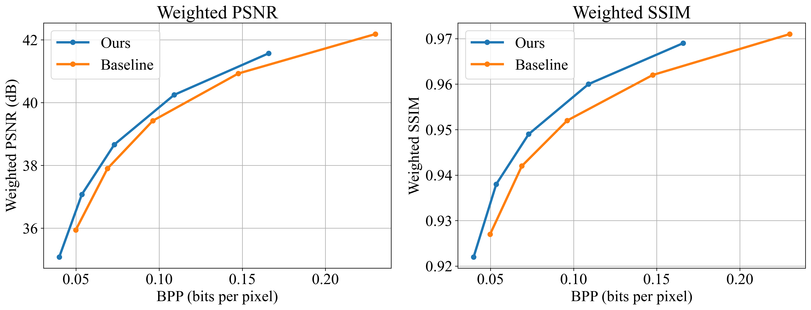

# LiDAR-guided ROI Learned Image Compression
[](https://doi.org/10.5281/zenodo.15728745)




## Install
```bash
git clone https://github.com/JoeK6279/LiDAR_Guided_ROI
cd Transformer_VariableROI
pip install -U pip
pip install torch torchvision # have to match with the cuda version
pip install pillow==9.2.0
pip install -e .
pip install timm tqdm click
```

## Pre-trained Weights
The pre-trained weights for our method can be downloaded below. <br>
<a href="https://github.com/JoeK6279/LiDAR_Guided_ROI/releases/download/v1.0/checkpoint.pth.tar" download>
  download link
</a>

## Dataset
The dataset used is ARKitScenes, which can be found [here](https://github.com/apple/ARKitScenes)

## Usage
- Modify the `config/eval.yaml` to specify path for dataset and pre-trained checkpoint
- run `python examples/eval_lidar.py -c config/eval.yaml` for proposed method
- run `python examples/eval_lidar_baseline.py -c config/eval.yaml` for baseline


## Ackownledgement
This work is adopted from [Transformer_VariableROI](https://github.com/NYCU-MAPL/Transformer_VariableROI) and [LiDAR-Depth-Map-Guided-Image-Compression-Model](https://github.com/AlessandroGnutti/LiDAR-Depth-Map-Guided-Image-Compression-Model). We thank the authors for open-sourcing their code.

